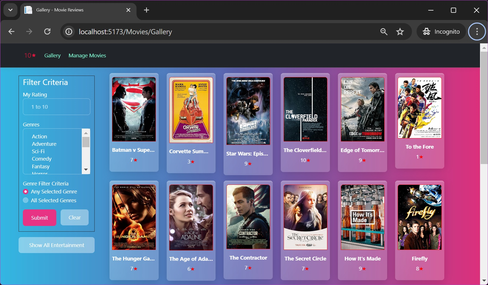
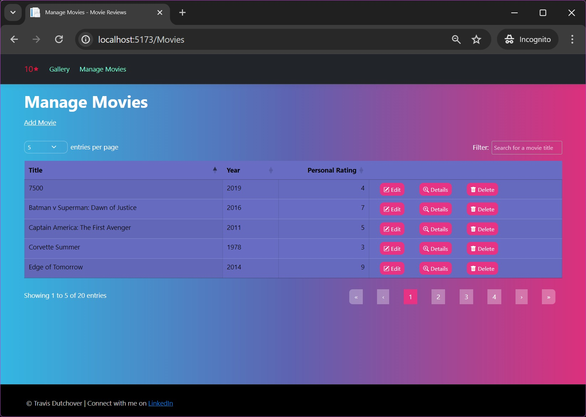
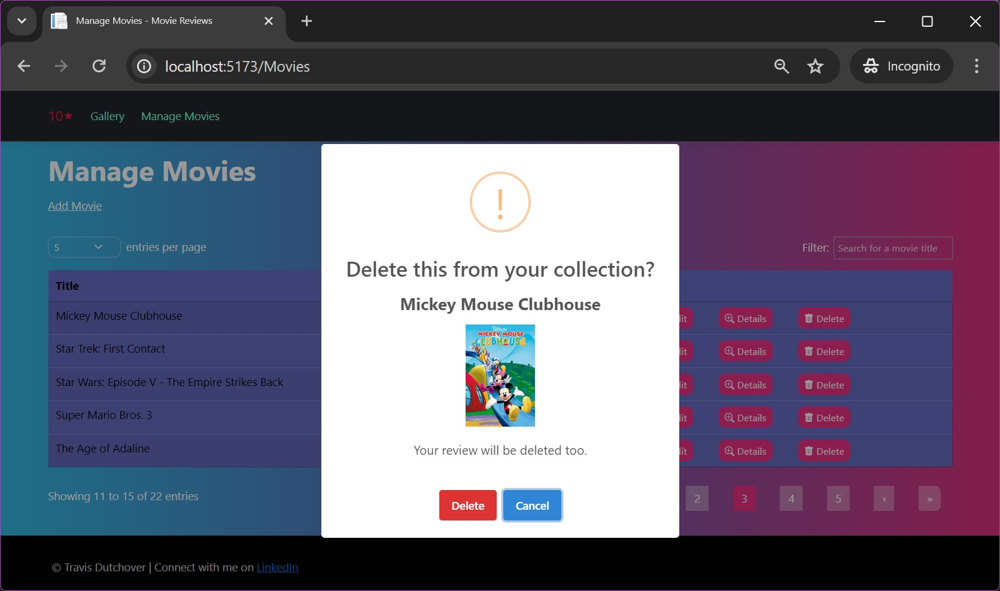
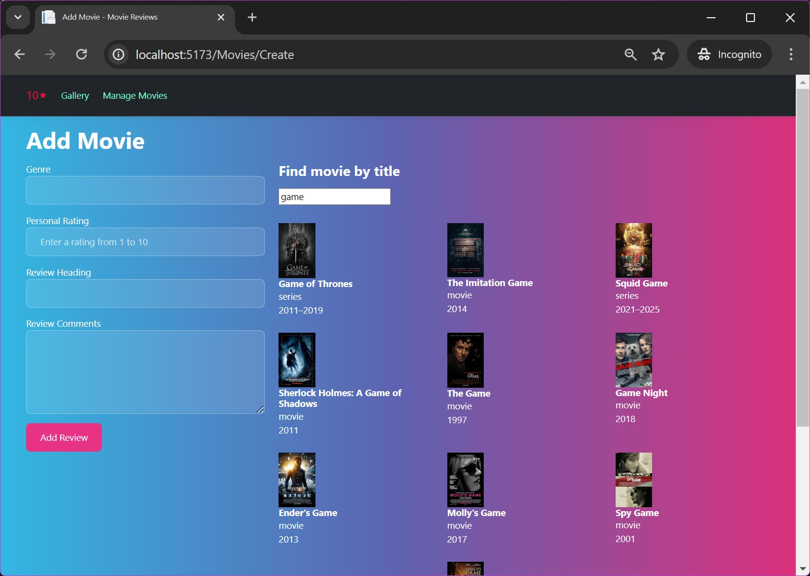
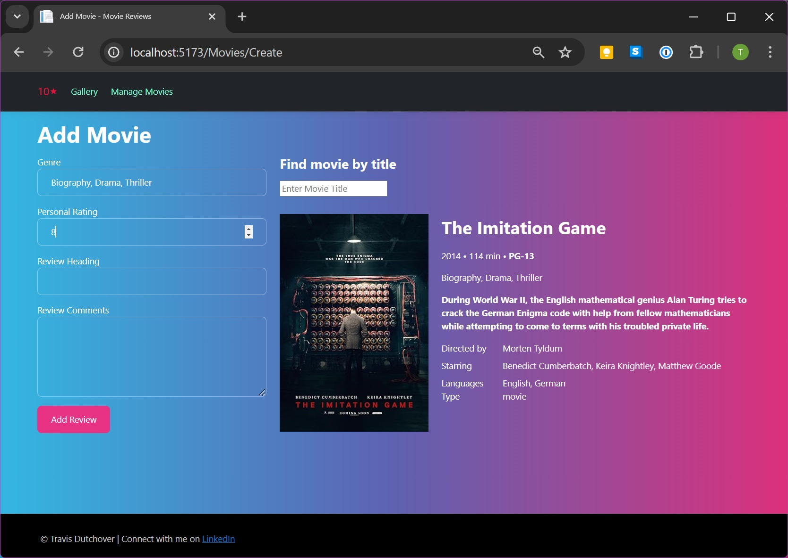
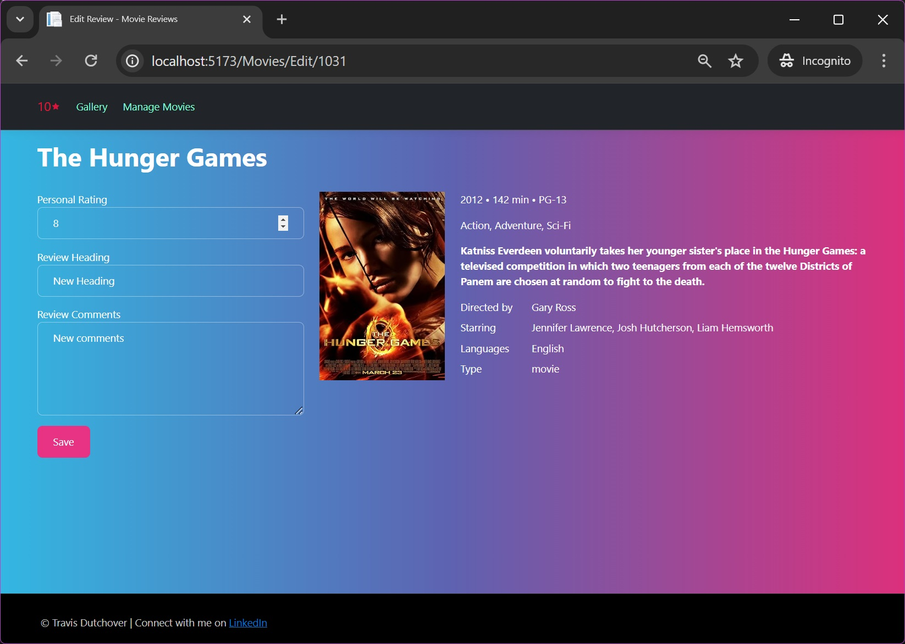
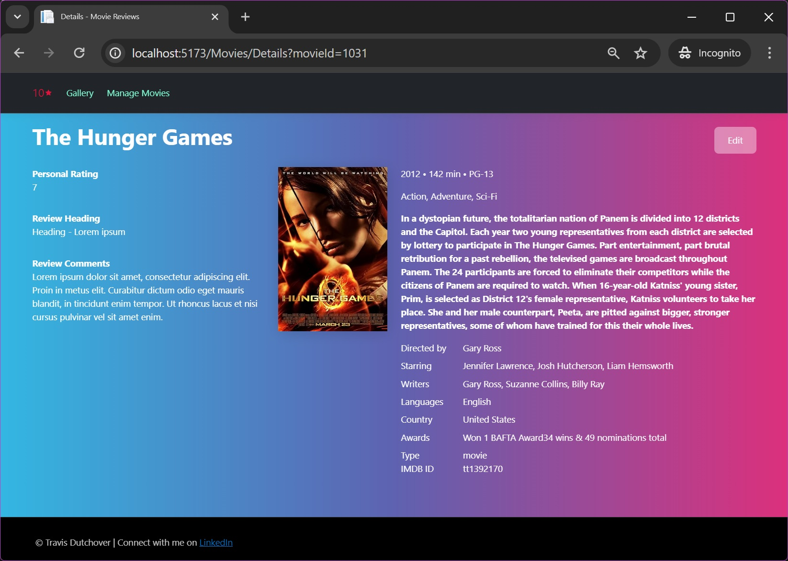

# Movie Reviews

## 📋 Overview
Movie Reviews is a demo web application designed for a single user to track their personal written movie reviews and ratings, which range from 1 to 10. I created this application based on my long-standing enjoyment of keeping personal movie reviews.

The application also allows users to add and review video games in the same way.

Further enhancements are planned.

## 🖥️ User Interface Pages

### Gallery Page
Displays all movies in the user’s personal movie collection and allows filtering by genre, rating, or a combination of both.

Click a movie image to navigate to the corresponding [Movie Details Page](#movie-details-page).

### Manage Movies Page
Provides full CRUD (Create, Read, Update, Delete) operations for managing the movie review collection.

  - Displays a link to the [Add Movie Page](#add-movie-page)
  - Shows a table of all movies in the user's personal movie collection.
    - The table supports multi-page navigation and sorting by column.
    - The table includes a search function to find movies by title within the personal collection.
    - The table provides access to the [Edit Review Page](#edit-review-page), [Movie Details Page](#movie-details-page), and the option to [delete](#delete-confirmation-dialog) a movie and its review.

#### Delete Confirmation Dialog
When the user clicks the Delete button for a specific movie, a confirmation dialog is displayed.

### Add Movie Page
Allows users to add new movies to their personal collection by selecting a movie, entering a rating, and optionally providing a written review.

  - Enables users to search for movies by title and select a movie to write a review.
    - Movies dynamically display as the user types each character of the title.
    - The user selects a movie by clicking its image.
  - **Feature Implementation:**
    - **Third-Party API Integration:** Retrieves movie data from a third-party public movie database API.
    - **Automatic Genre Addition:** When a user adds a new movie, the application checks if any of the movie’s genres are missing from the local SQL Server database. If new genres are found, they are automatically added to ensure all genres can be used as search filters on the [Gallery Page](#gallery-page).

**Caption: Searching for a movie by title**

**Caption: A selected movie ready to be added to the user's collection**

### Edit Review Page
Allows editing of an existing movie review and displays a compact version of the movie’s details.

### Movie Details Page
This page allows users to explore details about a selected movie.

- Displays comprehensive information about a movie, including an extended plot summary and the user's review.
- Clicking the movie image opens the movie trailer on IMDb in a new browser tab.

## 🛠️ Technologies Used
- **Languages:** C#, JavaScript
- **Frameworks:** ASP.NET Core, Entity Framework Core (with migrations)
- **Database:** SQL Server
- **Frontend:** Razor Views, Bootstrap 5, HTML, CSS
  - **Third-Party Libraries:**
    - [DataTables](https://datatables.net/): Provides advanced table features like pagination, sorting, and filtering.
    - [SweetAlert2](https://sweetalert2.github.io/): Used for customizable dialogs.
    - [Toastr](https://codeseven.github.io/toastr/): Used for popup notifications.
- **Backend:**
  - Provides RESTful APIs for database access and secure retrieval of movie data and images from a third-party API.
  - Uses secure configuration for accessing application secrets.
- **Design Patterns:** MVC, Repository, Unit of Work, Dependency Injection

# ⚠️ Key Limitations
- Single User Application: Does not support user accounts yet.
- No Authentication or Authorization.
- Limited Error Handling.
- No Unit Tests or Integration Tests.
- Responsive Design: The UI is primarily for a desktop browser. While the UI was developed to be mostly responsive and has been tested on some viewport sizes, it will not look good on all devices, particularly smaller ones.

***
Copyright © Travis Dutchover. All rights reserved.